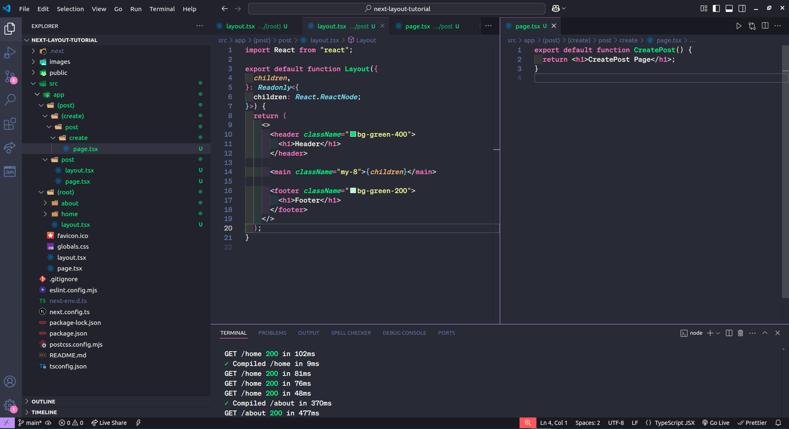

# Hiding Root Layout in Next.js Subpages: A Step-by-Step Guide

## Step 1

- Setup nextjs project


## Step 2

- Create Some layout and pages



### File and Folder Structures

```
├── favicon.ico
├── globals.css
├── layout.tsx
├── page.tsx
├── (post)
│   ├── (create)
│   │   └── post
│   │       └── create
│   │           └── page.tsx
│   └── post
│       ├── layout.tsx
│       └── page.tsx
└── (root)
    ├── about
    │   └── page.tsx
    ├── home
    │   └── page.tsx
    └── layout.tsx

```

## Step 3

- Visit `http://localhost:3000/post` with layout


## Step 4

- Visit `http://localhost:3000/post/create` without layout


# Follow me

- [Linkedin](https://www.linkedin.com/in/sheik-mostafizur/)
- [Twitter](https://x.com/sheikmostafizur)
- [GitHub](https://github.com/sheik-mostafizur)
