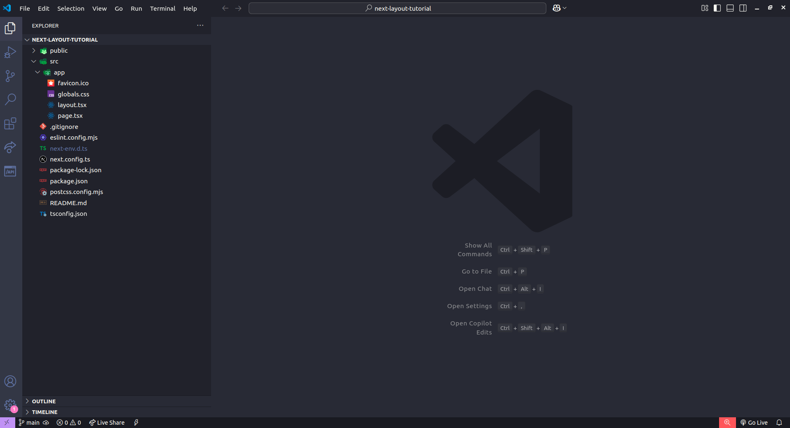
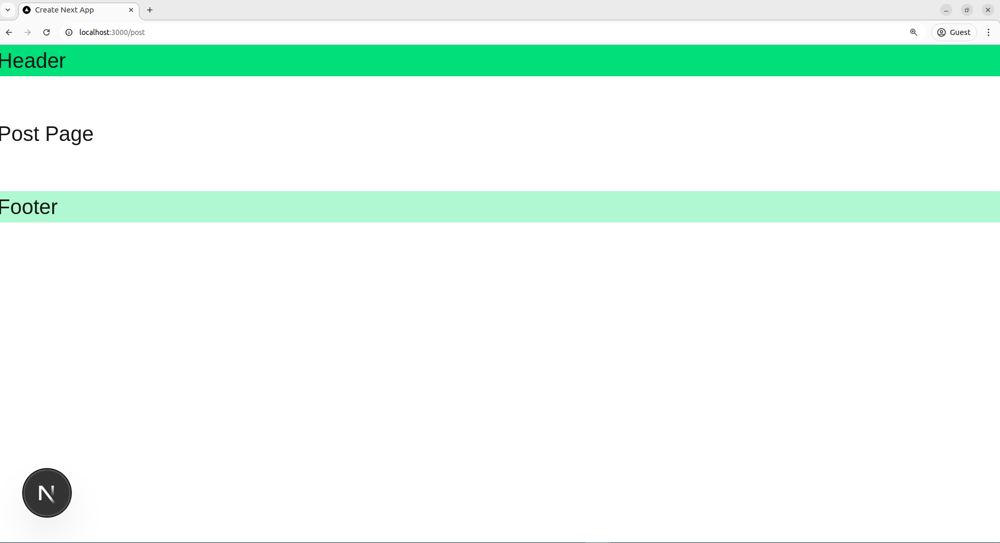
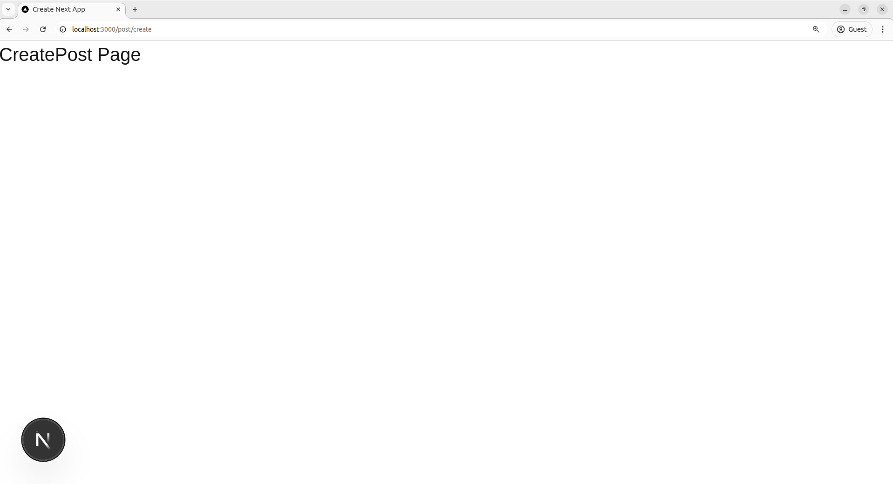

# Hiding Root Layout in Next.js Subpages: A Step-by-Step Guide

This guide will show you how to hide the root layout in specific subpages within a Next.js application. Follow the steps below to get started.

## Step 1: Set Up a Next.js Project

First, create a new Next.js project if you haven't already:

```bash
npx create-next-app@latest your-project-name
cd your-project-name
```



## Step 2: Create Layouts and Pages

Next, organize your project by creating layouts and pages. For this example, we will create several layouts and pages to demonstrate how to hide the root layout for specific subpages.

### File and Folder Structure

Ensure your project folder structure looks like this:

```
├── favicon.ico
├── globals.css
├── layout.tsx
├── page.tsx
├── (post)
│   ├── (create)
│   │   └── post
│   │       └── create
│   │           └── page.tsx
│   └── post
│       ├── layout.tsx
│       └── page.tsx
└── (root)
    ├── about
    │   └── page.tsx
    ├── home
    │   └── page.tsx
    └── layout.tsx
```

### Explanation:

- `layout.tsx` contains the main layout for the root page.
- The `(post)` directory has its own layout, which will be shown when visiting post-related pages.
- The `(create)` directory contains a page for creating posts and has no layout to show the root layout.

## Step 3: Visit `http://localhost:3000/post` to View Layout

Navigate to `http://localhost:3000/post` in your browser, and you should see the layout as defined in the post-related layout file.



## Step 4: Visit `http://localhost:3000/post/create` to Hide Layout

Next, visit `http://localhost:3000/post/create`. You will see that the root layout is hidden for this page, as the layout has been excluded in the `create` page directory.



## Follow Me

If you found this guide helpful, feel free to connect with me on social media!

- [LinkedIn](https://www.linkedin.com/in/sheik-mostafizur/)
- [Twitter](https://x.com/sheikmostafizur)
- [GitHub](https://github.com/sheik-mostafizur)
